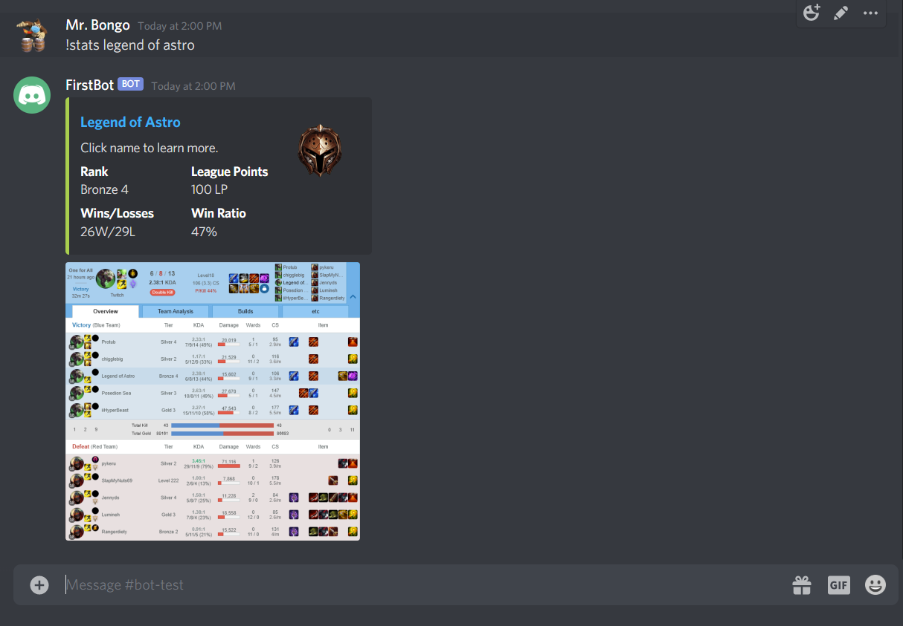
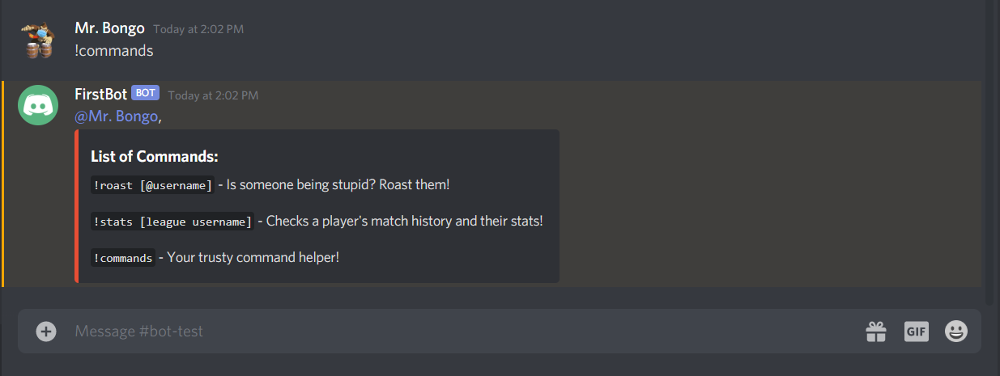

# Leauge Stats Bot
This bot is being made for my friend's discord server to allow them to find League of Legends stats at the click of a button. Requires the Puppeteer and Discord API.

All content utilized in this chatbot is based on content retreived from OP.GG.

 

## How to use the bot

### `!roast [discord username]`

This function will extract an insult (all league of legends based) from an array at random and reply to the user being roasted using Discord API's `message.reply()` command:

 

### `!stats [league username]`

This function will use the Puppeteer API to webscrape stat information (Rank, Win/Losses, League Points, Win Ratio, Most Recent Game) from OP.GG's DOMs for the username mentioned. It will then output it to the Discord chat via the Discord API's `message.channel.send()` command:

 

### `!commands`

Your trusty command helper!

